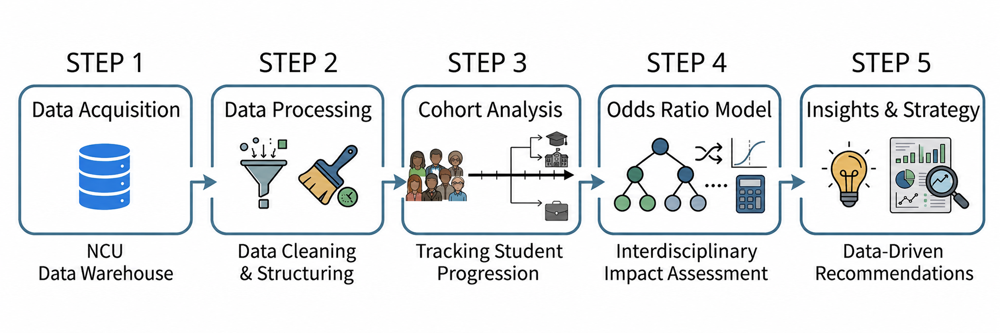

# Using Multilevel Odds Ratios to Analyze the Impact of Interdisciplinary Learning on Further Education Trends
> 利用多層次勝算比分析跨領域學習對繼續升學走向的影響

## Overview
This research analyzes how interdisciplinary learning experiences influence students’ further education trends using a multilevel odds ratio framework.

## Project Goal
To analyze the relationship between interdisciplinary learning experiences and students’ further education trends through hierarchical statistical analysis.

## The project focuses on:
- Large-scale educational data cleaning and integration
- Hierarchical odds ratio analysis
- Statistical modeling and trend analysis
- Data-driven educational insights and recommendations

## Methodology
1. Data extraction from educational data warehouses
2. Data preprocessing and structured dataset construction
3. Cohort-based classification
4. Multilevel odds ratio framework construction and analysis
5. Educational insight generation and recommendation analysis


## Tech Stack
- Python
- Pandas
- NumPy
- MSSQL

## Analytical Methods
- Multilevel Odds Ratio Analysis
- Cohort Study

## Result
- Identified relationships between interdisciplinary learning patterns and further education trends
- Constructed a hierarchical odds ratio analysis framework for educational analytics
- Generated data-driven insights for educational policy and decision-making
Example insight:
Students from highly specialized disciplines, such as information and electrical engineering, showed relatively lower motivation toward interdisciplinary learning compared to other academic fields.

## Repository Structure
```text
interdisciplinary-learning-analysis/
├── README.md
├── images/
│   ├── methodology.png
├── src/
```
